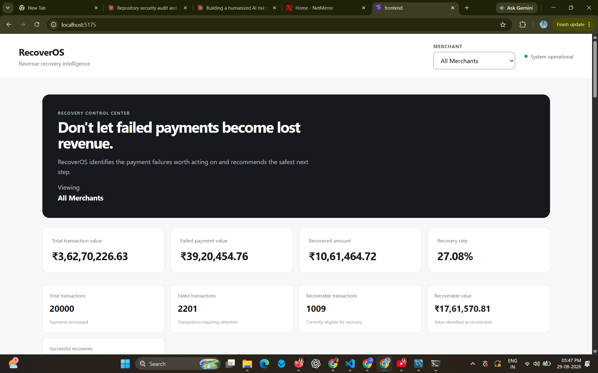
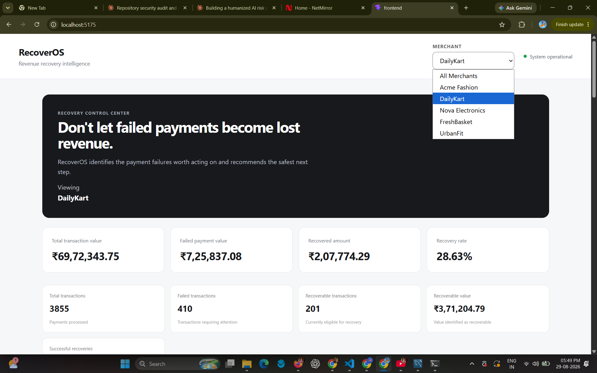
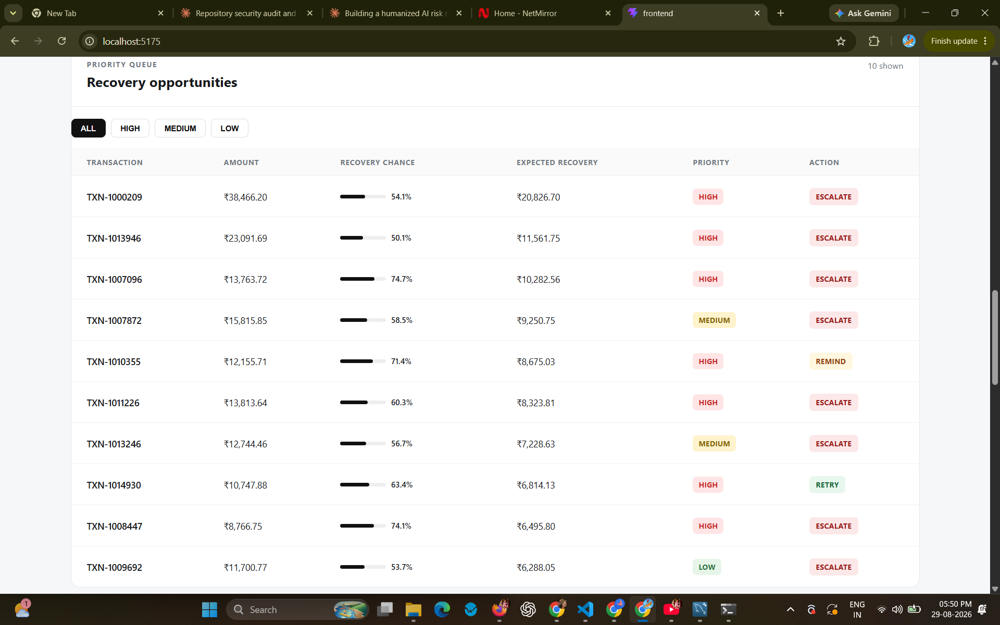
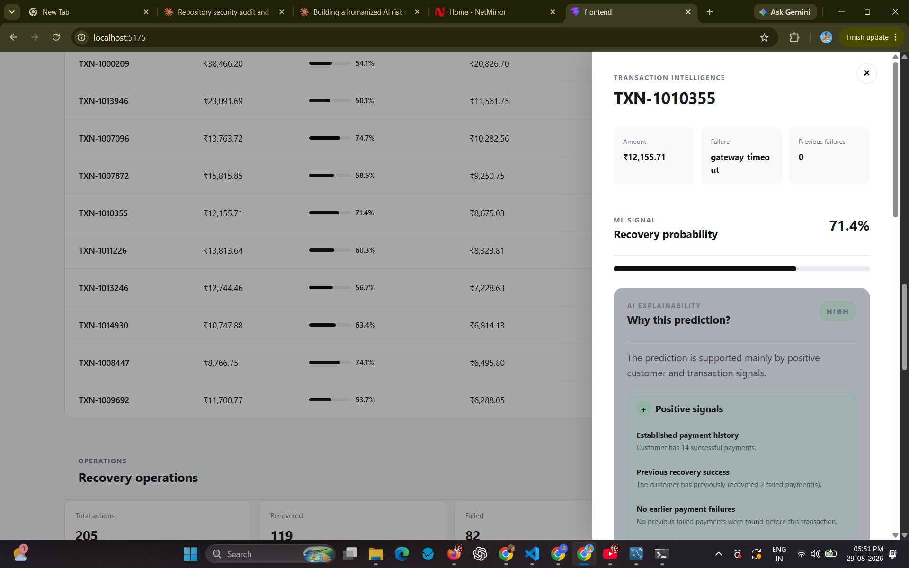
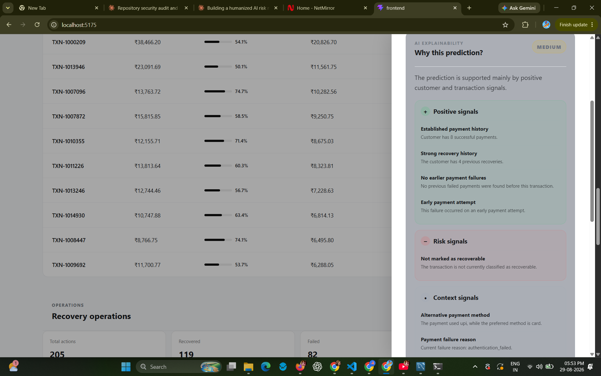
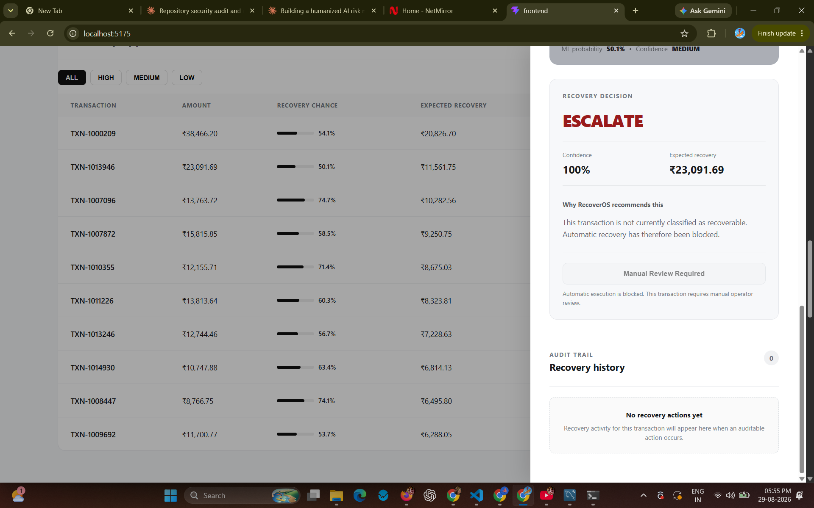
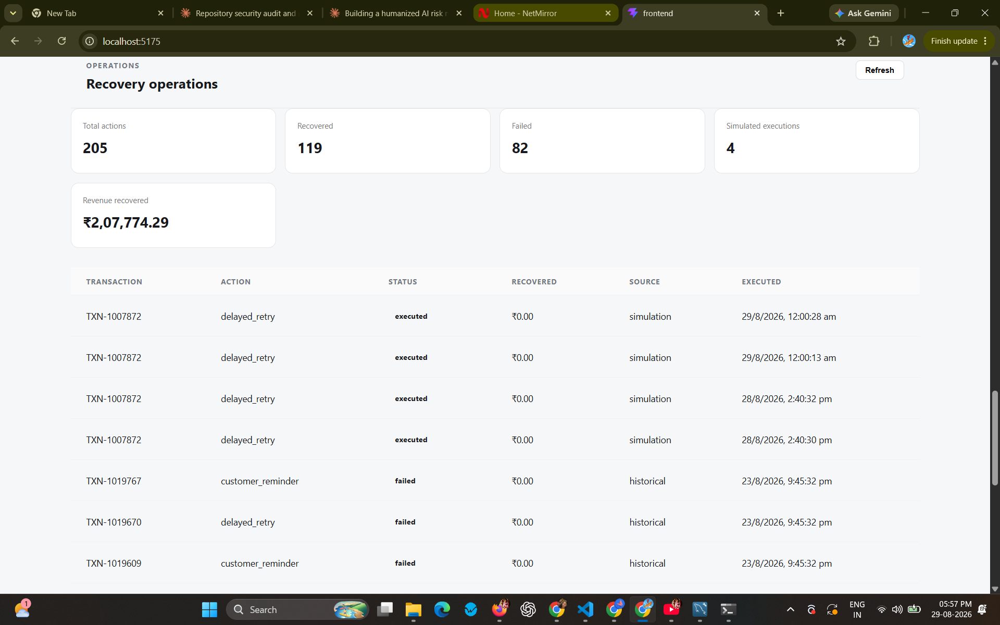
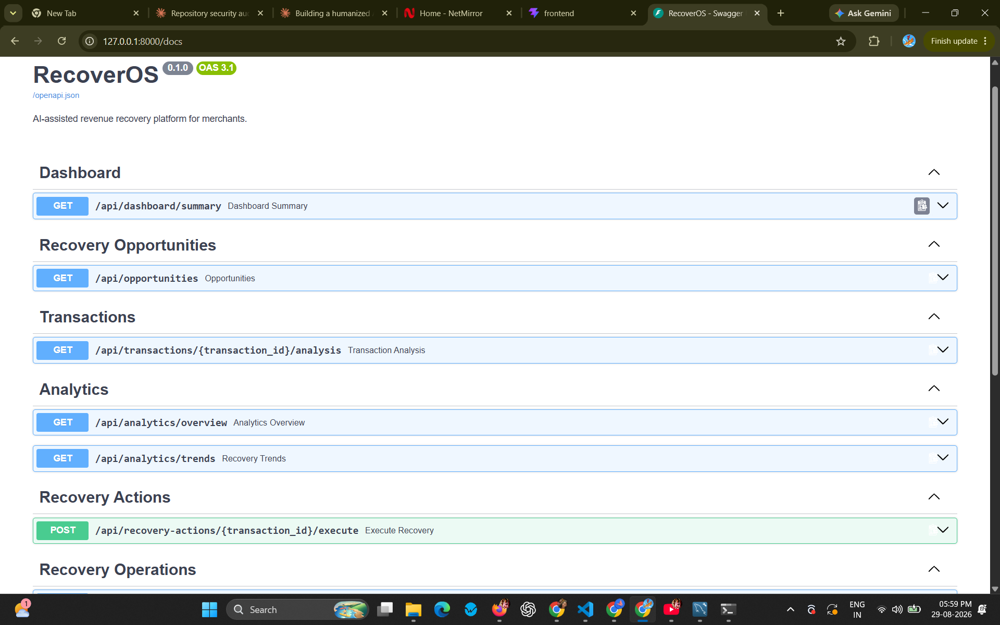

## Screenshots

### Recovery Intelligence Dashboard

The main dashboard provides an overview of transaction failures, recovery performance, recovered revenue and recovery opportunities.

### Merchant-Level Analytics

RecoverOS supports merchant-level filtering so recovery performance and opportunities can be investigated for individual merchants.

### Recovery Opportunities

Failed transactions are surfaced as recovery opportunities for further analysis and prioritization.

### Transaction Intelligence

Individual transactions can be analysed using transaction history, customer signals, ML recovery probability and the recovery decision engine.

### AI Explainability

RecoverOS provides human-readable positive, negative and neutral factors to explain recovery predictions and recommendations.

### Safety Guardrails

Manual-review and non-recoverable transactions are escalated rather than automatically executed, demonstrating the safety layer between prediction and recovery execution.

### Recovery Operations & Audit Trail

Recovery Operations provides visibility into simulated recovery actions and historical recovery activity.

### FastAPI / Swagger Documentation

The FastAPI backend automatically exposes interactive OpenAPI documentation for the RecoverOS REST APIs.