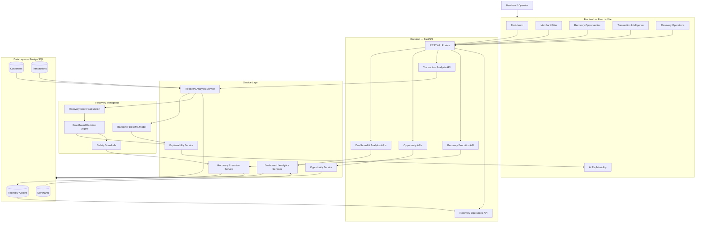
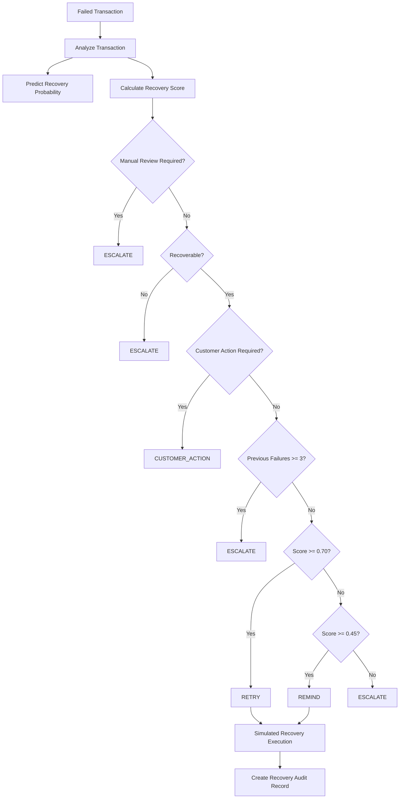

# RecoverOS — System Architecture

## 1. Overview

RecoverOS is an AI-assisted revenue recovery platform designed to identify failed-payment recovery opportunities and recommend appropriate recovery actions.

The system combines:

- Transaction and customer data
- Machine Learning recovery prediction
- Rule-based decision logic
- Safety guardrails
- Human-readable explainability
- Simulated recovery execution
- Recovery audit history
- Merchant-level analytics

The current implementation is a prototype. Recovery actions are simulated and do not perform real payment retries or send real customer communications.

---

## 2. High-Level Architecture



---

## 3. Frontend Layer

The RecoverOS frontend is built using **React and Vite**.

It provides the interface through which a merchant or operator interacts with the recovery system.

Major frontend functionality includes:

- Recovery dashboard
- Merchant filtering
- Recovery opportunity listing
- Transaction analysis
- AI explainability
- Recovery action execution
- Recovery history
- Recovery Operations dashboard
- Recovery trend visualization
- Loading, error and empty states
- Responsive layouts

The frontend communicates with the FastAPI backend using HTTP/JSON requests.

---

## 4. Backend API Layer

The backend is implemented using **FastAPI**.

FastAPI exposes REST APIs used by the frontend to access recovery intelligence and analytics.

Major API areas include:

### Dashboard

Provides summary statistics such as:

- Total transactions
- Failed transactions
- Recovered transactions
- Recovery rate
- Recovered amount
- Failed amount

### Opportunities

Returns failed transactions that can be investigated as potential recovery opportunities.

### Transaction Analysis

Analyzes an individual transaction and returns:

- Transaction information
- ML recovery probability
- Recovery decision
- Decision confidence
- Recovery signals
- Explainability information
- Recovery history

### Recovery Trends

Provides historical recovery information for visualization.

### Recovery Operations

Provides recovery execution and audit information across transactions.

### Merchants

Provides merchant information for merchant-level filtering and analytics.

---

## 5. Service Layer

Business logic is separated from the API routes through backend services.

The service layer is responsible for:

- Dashboard aggregation
- Analytics calculations
- Opportunity discovery
- Transaction analysis
- ML inference
- Explainability
- Recovery execution
- Recovery history

This separation keeps API routing independent from the main business logic.

---

## 6. Machine Learning Layer

RecoverOS uses a Machine Learning model to estimate the probability that a failed transaction can be successfully recovered.

Two models were evaluated:

| Model | Accuracy | Precision | Recall | F1 Score | ROC-AUC |
|---|---:|---:|---:|---:|---:|
| Logistic Regression | 0.658 | 0.729 | 0.661 | 0.693 | 0.669 |
| Random Forest | 0.624 | 0.684 | 0.661 | 0.672 | **0.695** |

The **Random Forest model** was selected because it achieved the better ROC-AUC score.

The trained model is stored using Joblib and loaded by the backend for prediction.

### ML Output

The ML layer produces a recovery probability.

For example:

```text
Recovery Probability = 0.68
```

This probability represents the model's estimate of recovery likelihood.

The ML probability does **not** directly authorize a recovery action.

---

## 7. Recovery Decision Engine

RecoverOS contains a separate rule-based decision engine.

The engine calculates a recovery score using signals such as:

- Previous transaction failures
- Customer recovery rate
- Payment degradation
- Previous retry success

Based on the score and transaction conditions, the engine recommends one of four actions:

```text
RETRY
REMIND
CUSTOMER_ACTION
ESCALATE
```

### Basic Threshold Logic

```text
Score >= 0.70
        |
        v
      RETRY

Score >= 0.45 and < 0.70
        |
        v
      REMIND

Score < 0.45
        |
        v
    ESCALATE
```

These thresholds are applied only after higher-priority safety conditions are considered.

---

## 8. Safety Guardrails

Safety guardrails override normal score-based decisions.

The current decision order includes:

### Manual Review

```text
requires_review = true
        |
        v
    ESCALATE
```

The system does not automatically execute transactions requiring manual review.

### Non-Recoverable Transaction

```text
is_recoverable = false
        |
        v
    ESCALATE
```

Automatic recovery is blocked.

### Customer-Action Failure

Certain failure reasons require the customer to resolve the problem.

Examples include:

```text
expired_card
invalid_card
authentication_required
insufficient_funds
```

These result in:

```text
CUSTOMER_ACTION
```

### Failure Limit

If:

```text
previous_failures >= 3
```

the system returns:

```text
ESCALATE
```

This prevents repeated automatic recovery attempts.

---

## 9. Decision Flow

The complete transaction decision process can be represented as:



---

## 10. Explainability Layer

RecoverOS provides human-readable explanations for recovery predictions and decisions.

The explanation system uses transaction and recovery features to identify factors that positively or negatively influence recovery expectations.

The interface can display:

- Positive factors
- Negative factors
- Neutral factors
- Confidence band
- Prediction summary
- Decision reason

The current implementation uses **feature-based business explanations**.

It does not currently use SHAP or another model-native attribution framework.

This distinction is important because RecoverOS separates:

```text
ML Prediction
        +
Business Rules
        +
Safety Guardrails
        +
Human-Readable Explanation
```

---

## 11. Recovery Execution Layer

Recovery execution is intentionally restricted.

Only these recommended actions are currently eligible for simulated execution:

```text
RETRY
REMIND
```

The execution service independently checks guardrails before executing an action.

This provides defense-in-depth even if another part of the application incorrectly requests an unsafe action.

### RETRY

A retry recommendation creates a simulated:

```text
delayed_retry
```

recovery action.

### REMIND

A reminder recommendation creates a simulated:

```text
customer_reminder
```

recovery action.

### Blocked Actions

Actions such as:

```text
ESCALATE
CUSTOMER_ACTION
```

are not automatically executed.

---

## 12. Recovery Audit Trail

Every simulated recovery execution creates a recovery action record.

The audit information allows RecoverOS to track:

- Transaction ID
- Recovery ID
- Recommended action
- Executed action
- Execution status
- Recovery outcome
- Execution timestamp

This provides traceability between a recovery recommendation and the resulting simulated action.

---

## 13. Data Layer

RecoverOS uses **PostgreSQL** as its primary database.

Core entities include:

### Merchants

Stores merchant information.

### Customers

Stores customer information and recovery-related history.

### Transactions

Stores payment transactions, including failed-payment information.

### Recovery Actions

Stores historical and simulated recovery actions.

The backend accesses PostgreSQL through **SQLAlchemy**.

---

## 14. End-to-End Data Flow

The full RecoverOS workflow is:

```text
Merchant
   |
   v
React Dashboard
   |
   v
FastAPI
   |
   v
Transaction / Analytics Services
   |
   +----------------------+
   |                      |
   v                      v
Random Forest        Recovery Score
Prediction           Calculation
   |                      |
   +----------+-----------+
              |
              v
       Decision Engine
              |
              v
         Guardrails
              |
              v
        Explainability
              |
              v
    Recommended Action
              |
      +-------+-------+
      |               |
 RETRY / REMIND    ESCALATE /
      |          CUSTOMER_ACTION
      v               |
Simulated Execution   v
      |          No automatic
      |           execution
      v
Recovery Action
Audit Record
      |
      v
PostgreSQL
      |
      v
Recovery Operations
Dashboard
```

---

## 15. Design Principles

RecoverOS follows several important engineering principles.

### Separation of Prediction and Decision

Machine Learning predicts recovery likelihood.

It does not directly decide whether a recovery action should be executed.

### Guardrails Before Automation

Safety conditions override recovery scores.

### Explainable Decisions

Users receive understandable reasons for recommendations.

### Defense-in-Depth

The recovery execution service independently verifies whether an action is allowed.

### Auditability

Simulated recovery activity is recorded so actions can be reviewed later.

### Merchant-Level Isolation

Analytics and recovery information can be filtered at merchant level.

---

## 16. Current Prototype Boundary

RecoverOS currently simulates recovery actions.

The project does **not** currently:

- Retry real payments
- Charge real customers
- Send real SMS messages
- Send real emails
- Connect to a production payment gateway

A production implementation would additionally require:

- Authentication and authorization
- Payment-provider integration
- Secure secrets management
- Idempotency protection
- Retry scheduling infrastructure
- Customer communication providers
- Monitoring and alerting
- Compliance review
- Production risk controls

---

## 17. Technology Summary

| Component | Technology |
|---|---|
| Frontend | React + Vite |
| Backend | FastAPI |
| Language | Python / JavaScript |
| Database | PostgreSQL |
| ORM | SQLAlchemy |
| Machine Learning | scikit-learn |
| ML Model | Random Forest |
| Data Processing | pandas / NumPy |
| Model Persistence | joblib |
| Visualization | Recharts |
| Testing | pytest |
| API Documentation | Swagger / OpenAPI |

---

## 18. Architecture Summary

RecoverOS follows the architecture:

```text
React/Vite
     |
     v
FastAPI REST API
     |
     v
Service Layer
     |
     +-------------------+
     |                   |
     v                   v
ML Prediction      Decision Engine
(Random Forest)      (Rules)
     |                   |
     +---------+---------+
               |
               v
          Guardrails
               |
               v
        Explainability
               |
               v
      Recovery Recommendation
               |
               v
      Safe Simulation Layer
               |
               v
          Audit Trail
               |
               v
          PostgreSQL
```

This architecture keeps prediction, business decision logic, safety enforcement, execution, and auditing separated so that each component can be tested and improved independently.